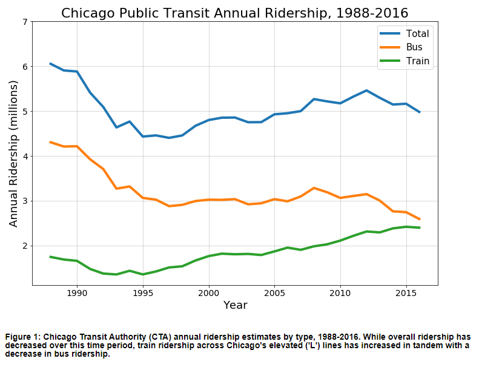

I liked this plot, partially because I recently moved from Chicago myself, took the CTA every day (Blue Line!), and nearly used CTA data as the basis for my own HW8 plot. It's interesting to consider how many different stories you can tell with the same data set.

Student used Python/Matplotlib, and the line chart is nicely set - colors and lines are crisp, the grid is appropriatly light, the legend is placed well, the y-axis scale is nicely handled, and the proportions are perfect.

A few points I might adjust - using either a difference in alpha or line thickness to distinguish the train/bus lines from the total line, plotting the data field by month-year rather than just year (especially to see if the rail and bus converged so far this year), and adding minor ticks for each year.

Two other features that increase the effectiveness of the plot: the caption is helpful and descriptive, and the data has a clear "so what" (that the ridership has decreased while the ratio of train to bus rides is higher than ever).
