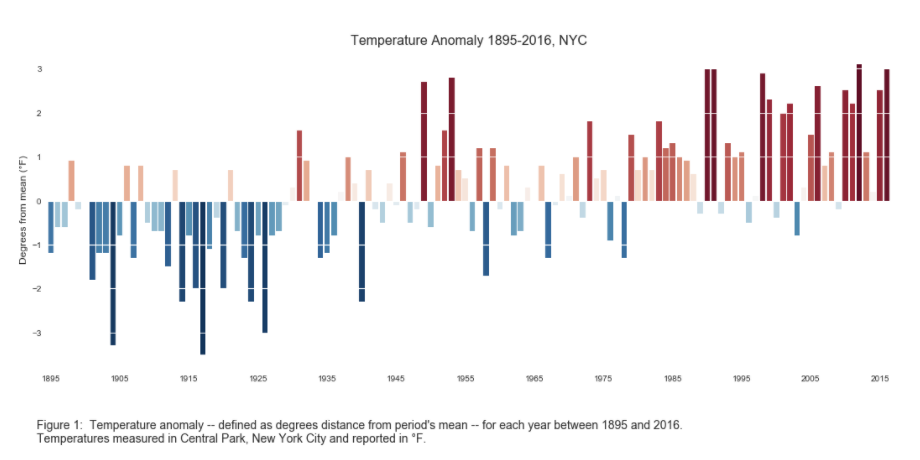

# Review of Homework 8 Plot
### Emily Hansen

 
The plot: 

  
  

Review:

  
## Clarity
 At first glance, the plot intuitively
appears to show values deviating in positive and negative directions from a 
pre-established value over time. It is unclear what "distance from
the period's mean" is because the period is not defined anywhere in the text 
(so it is also unclear if the period changes over the course of the time in the plot).
The values themselves being plotted are clear.

## Aesthetic 

Colors were chosen with common intuition about temperature and color,
with cooler-than-average years' data being plotted blue
and warmer-than-average years' data being plotted red. I think it is not necessary
to have a color gradient within the warmer and cooler groups unless it has some
statistical meaning (such as if every standard deviation from the mean got a bar
that was darker in color). Some of the lighter colors are hard to read at all.

## Honesty

The data are plotted as-is with minimal bias. The data are from such
a long range of dates that the view is holistic. That being said, changing the period
would change the period mean, which could, in hypothetical variations of the plot,
change the number of "red" and "blue" days.

## Improvements

This approach makes it obvious that there are more warmer years as time goes on, but
it emphasizes counting the years as opposed to temperature trends. Consider
that a simple time series line plot would have shown the trend of average 
temperature increase more clearly.
