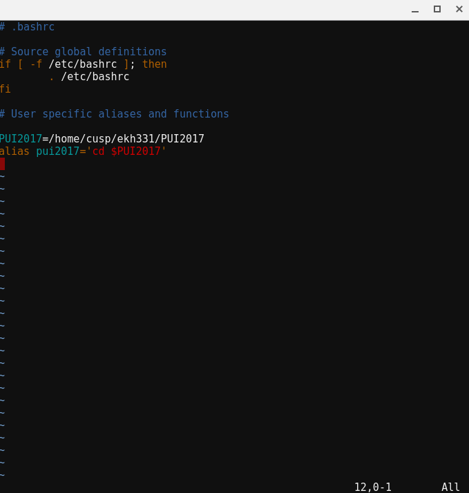
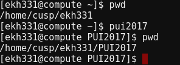

# PUI2017_ekh331

This homework assignment was completed by individually except in the case of needing a partner to perform the repository forking and merge requests with another user. In this case, my partner was Vivian (Yukun) Wan; we forked repositories and sent merge requests to each other.
#
The environment was set up by first creating a directory by the name of PUI2017 in a remotely-accessed CUSP computing environment.
#
The environment variable PUI2017 and the alias pui2017 were then created by editing the home directory's .bashrc in VI, as shown below in Figure 1.
#

 Figure 1: Establishing an environment variable and alias
#
 This addition to the .bashrc meant that after rerunning .bashrc, simply typing 'piu2017' in the terminal resulted  in entering the PUI2017 directory. To confirm this, working directories were printed before and after entering 'pui2017' in the terminal, as shown in Figure 2 below.
#

 Figure 2: Confirming successful setup of environment variable and alias
#

